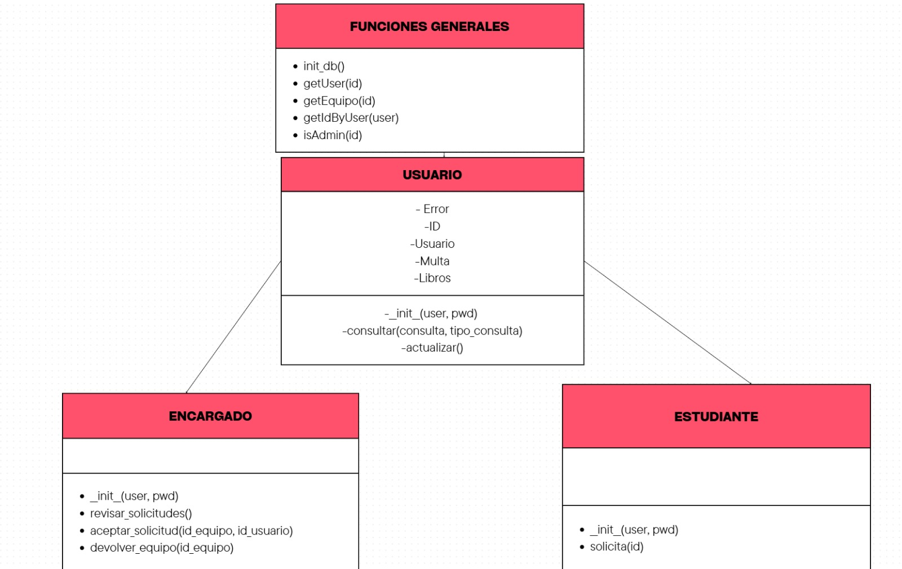

# Sistema gestion de inventario (lab de Electronica)
en este trabajo realizamos en Python un sistema para el laboratorio de Electronica

## Proceso de realización del código
Realizar este código fue un proceso un poco complejo, principalmente porque fue necesario entender cómo funcionaban las diferentes partes del programa y cómo se conectaban entre ellas. Al principio no fue tan fácil saber qué debía hacer cada función, ya que el código utiliza un módulo llamado `proc`, en el cual se encuentran diferentes clases y funciones que permiten manejar a los estudiantes, encargados, equipos y solicitudes.

Primero se realizó la parte del estudiante. En esta parte se crea un estudiante utilizando un usuario y una contraseña. Después se revisa si ocurrió algún error al iniciar sesión. Si todo está correcto, el programa muestra un mensaje y también revisa si el estudiante tiene permisos de administrador. Esto fue importante para entender que no todos los usuarios tienen las mismas funciones dentro del programa.

Después se hizo la parte de las consultas. El estudiante puede buscar un equipo, en este caso unos amplificadores, y recibir la información del equipo. Luego, utilizando el `id` del equipo encontrado, se puede hacer una solicitud. Esta parte fue algo complicada porque había que tener en cuenta diferentes resultados: si la solicitud se hizo correctamente, si no se puede solicitar el equipo o si el usuario ya había hecho una solicitud anteriormente. Para esto se utilizaron condiciones `if` que permiten mostrar un mensaje diferente dependiendo de lo que ocurra.

También se realizó la parte del encargado. Esta funciona de una manera parecida, pero el encargado tiene otras opciones. Puede consultar equipos, revisar las solicitudes y aceptar una solicitud. Además, puede registrar la devolución de un equipo. Esta parte fue un poco más difícil porque había que entender el orden en el que se realizan las acciones. Por ejemplo, primero se debe aceptar una solicitud y después se puede realizar la devolución del equipo.

Al final del programa se utiliza `proc.init_db()` para iniciar la base de datos y después se le pregunta al usuario si quiere entrar como estudiante o como encargado. Dependiendo de lo que escriba, se ejecuta una de las dos funciones principales.

Una de las partes más complicadas fue entender cómo se comunicaba este código con el módulo `proc`, porque muchas de las funciones utilizadas en el programa no están escritas directamente aquí. Por ejemplo, funciones como `consultar()`, `solicitar()`, `revisar_solicitudes()` y `aceptar_solicitud()` dependen de lo que está programado dentro de ese módulo. Por eso fue necesario revisar y entender qué información recibía cada función y qué resultado devolvía.

En general, hacer este código ayudó a entender mejor cómo se pueden organizar diferentes acciones dentro de un programa. También permitió practicar el uso de clases, condiciones, funciones y variables. Aunque al principio fue complicado entender cómo funcionaba todo, al ir revisando cada parte por separado fue más fácil comprender el proceso. Una de las cosas que más aprendí fue que no es necesario intentar entender todo el código de una sola vez, sino que es mejor dividirlo en partes pequeñas y revisar qué hace cada una.

## Iniciar el código
```
python main.py
```
Se requieren tanto `equipo.txt` como `usuarios.txt` para que el programa funcione.

## UML


## Miembros

- Nicolas Luengas
- Jonathan Archila
- Andrés Casallas
- Alejandro campuzano